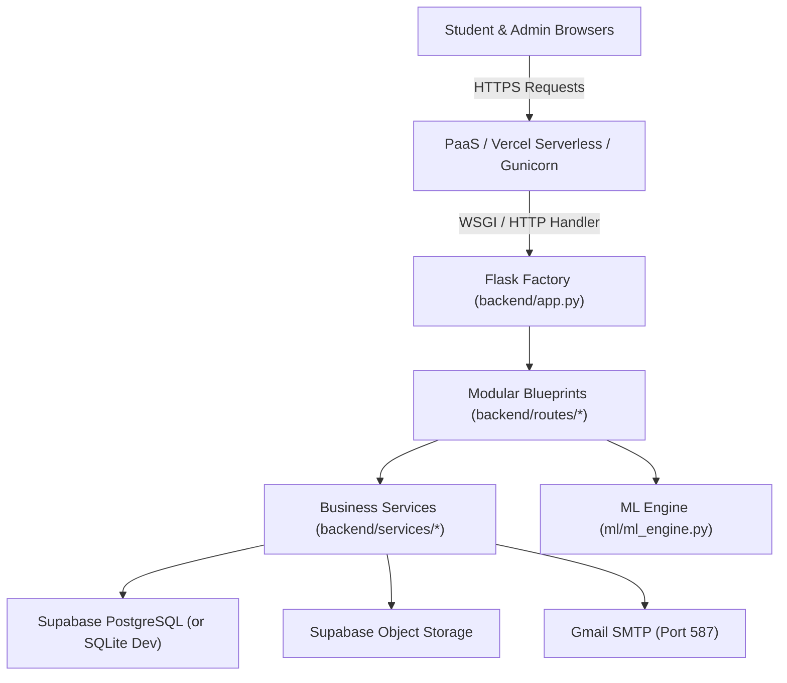

# IntelliHostel System Architecture

## Architecture Overview

IntelliHostel is a modular, production-ready web application built with Flask, Jinja2, PostgreSQL (via Supabase), Supabase Storage, and Scikit-Learn NLP.

## Layers
1. **Frontend (`frontend/`)**: Modular Jinja2 templates (`base.html`, `public/`, `student/`, `admin/`, `errors/`) and static assets (`css/`, `js/`, `images/`).
2. **Backend Entrypoint (`app.py`, `wsgi.py`)**: Thin WSGI layer delegating to `backend.app.create_app()`.
3. **Application Core (`backend/`)**:
   - `backend/config/`: Environment configuration loaded from `.env`.
   - `backend/database/`: PostgreSQL / SQLite connection pooling and schema initialization.
   - `backend/services/`: Authentication, CSRF protection, email delivery, notifications, cloud storage, and common issue clustering.
   - `backend/routes/`: Modular team blueprints for administrative and student operations.
4. **Machine Learning (`ml/`)**: Logistic regression and Ridge regression models trained from `data/training_data.csv`.
5. **Data Layer (`data/`)**: Canonical training datasets.
